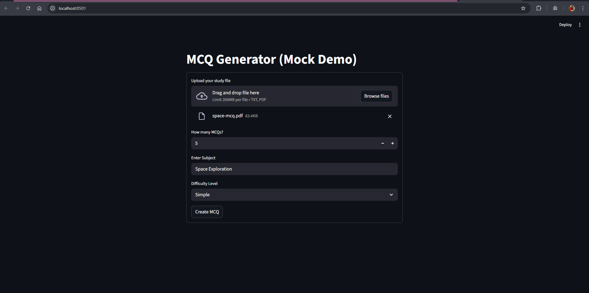
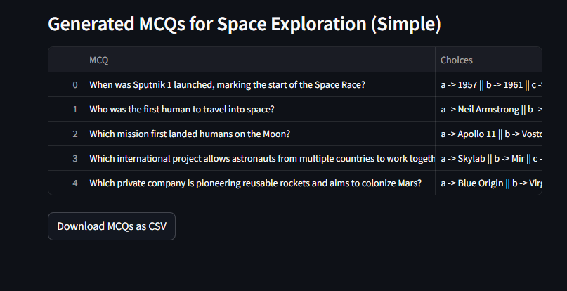
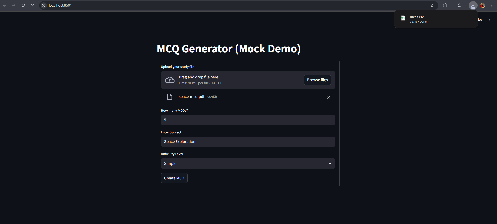
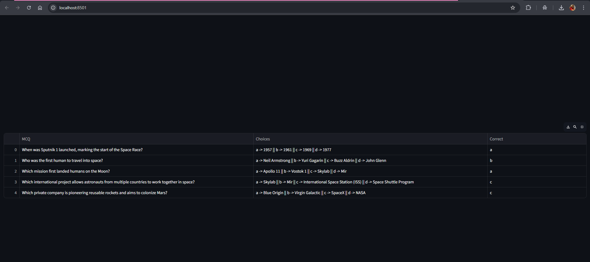

# MCQ Generator

A **Streamlit-based MCQ Generator** that allows you to generate multiple-choice questions from a text or PDF file using mock JSON responses. This is currently a **demo version** that uses `Response.json` instead of OpenAI API.

## Features

- Upload a study file (`.txt` or `.pdf`) for context.
- Specify the number of MCQs to display. (between 3 and 20)
- Set the subject. (max char = 50)
- Set difficulty level (Simple, Intermediate, Hard).
- Display MCQs in a **table format**.
- **Download MCQs as CSV**.


**Home page UI**


**MCQs generated**


**CSV file downloaded**


**CSV file content**


**Final output**

## Folder Structure

mcq-generator/  
│  
├─ Experiments/  
│ ├─ mcq.ipynb  
│ ├─ (csv file)

├─ src/  
│ ├─ mcqgenerator  
│ ├─ ├─ **init**.py  
│ ├─ ├─ logger.py  
│ ├─ ├─ MCQgenerator.py  
│ ├─ ├─ utils.py  
│ ├─ **init**.py

├─ .env  
├─ .gitignore

├─ data.txt  
├─ Response.json  
├─ setup.py  
├─ test.py  
├─ Streamlit.py  
└─ requirements.txt

## Setup and Installation

### Clone the repository

```bash
git clone https://github.com/shreya-chinnari/mcq-generator.git
cd mcq-generator
```

### Create a virtual environment (recommended)

```bash
python -m venv venv

```

source venv/bin/activate # Linux/macOS  
venv\Scripts\activate # Windows

### Adjust Jupyter Notebook kernel

Go to Kernel -> Change Kernel -> (the name of your environment).

### Install dependencies:

```bash
pip install -r requirements.txt

```

### Run Streamlit

```bash
streamlit run StreamlitApp.py
```

> Open the URL displayed in the terminal (usually http://localhost:8501).
